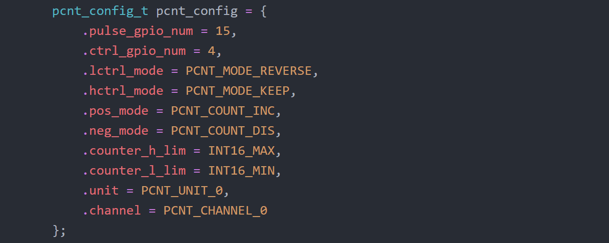

TEST SUMMARY
====================

## ROTARY ENCODER USING PCNT DRIVER 

**Date : 09^th^ Jan, 2019**

---

This is a summary of learnings I've made while testing the encoder on `Pulse Counter` module

* Structs in C++ require ordered declaration

  For example, 

  

  The above order is the correct initialization order of the struct `pcnt_config_t`, **unlike** the specified version in the `PCNT` example in *ESP-IDF*.

* If the encoder used is **2500PPR**, we can only achieve a resolution of **2500 counts per revolution** using a single PCNT unit, due to its configurability (Could be wrong!). To get **10000 counts per revolution**, we need to route these ports to 2 PCNT units with reversed `pulse`-`control` configuration and somehow combine the data from each of these two streams.

* The filter can be safely ignored in this case, due to stable pulses. 

* The interrupts have been disabled using `pcnt_intr_disable(PCNT_UNIT_X)` , which naturally cuts off events.